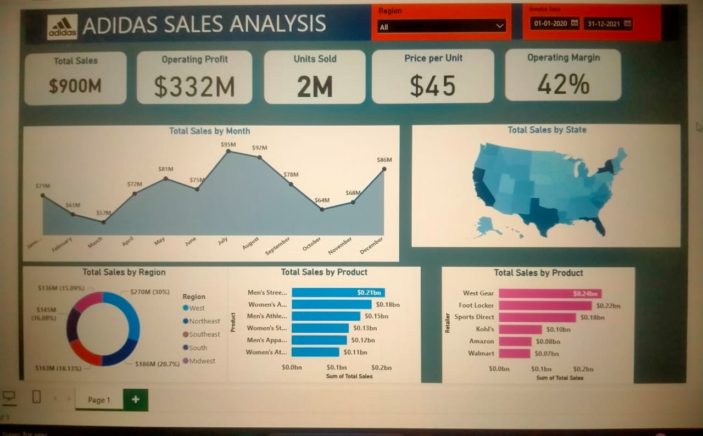

# 👟 Adidas Sales Analysis using Power BI

## 📊 Project Overview

This project focuses on analyzing Adidas sales data using **Power BI** to uncover trends in regional performance, product category performance, profit margins, and customer behavior. The interactive dashboard provides actionable insights that can assist in sales strategy, marketing, and inventory decisions.

---
## 🎯 Objectives

- Understand sales performance across different regions and states.
- Analyze profit margins and revenue trends.
- Identify high-performing product categories.
- Visualize KPIs such as total revenue, total profit, average price, and units sold.

---
## 🧾 Dataset

- **Source:** YouTube (for learning purposes)   
- **Description:** The dataset includes details like date, state, region, product type, unit price, cost, profit, units sold, and total revenue.

**Key Columns:**
- `Date`
- `Region`
- `State`
- `Product`
- `Unit Price`
- `Units Sold`
- `Cost`
- `Revenue`
- `Profit`

---
📊 Key Insights
- **Average Rating:** 3.66 | **Avg Price per Meal:** ₹348 | **Avg Delivery Time:** ~54 mins
- Top 5 food types: Indian, Chinese, North Indian, Fast Food, South Indian
- Most expensive areas include Vile Parle, Pacific Mall, and Brigade Road
- Top cities and areas with the most restaurants: Kolkata, Mumbai, Rohini, Andheri, etc.

🔍 Problem Statement
Adidas needed to understand its U.S. sales performance by product, region, retailer, and time to make better decisions around distribution and marketing.

⚙️ Challenges Faced
- Profit margin and monthly metrics were not given — had to be calculated manually.
- Had to balance many insights (regions, products, retailers, months) in a single dashboard.

✅ How I Solved It
- Cleaned data in Excel and imported into Power BI.
- Used calculated fields in DAX to derive key KPIs (Profit, Margin, Monthly Totals).
- Organized dashboard using slicers and cards for clarity.

🌟 Final Outcome / Impact
- Delivered a clean Power BI dashboard with:
  - 💵 Sales: $900M | 🧾 Profit: $332M | 📦 Units Sold: 2M
  - Insights on top product: Men's Street Footwear
  - West region and West Gear identified as top performer
- Helped simulate business decisions on performance trends, regions, and product categories.

## 📁 Project Structure

Adidas-Sales-PowerBI/
├── Dataset/
│ └── adidas_sales.csv
├── PowerBI/
│ └── Adidas_Sales_Analysis.pbix
├── Images/
│ └── adidas_dashboard.png
└── README.md

## 🖼️ Dashboard Screenshots

## ✅ Conclusion

This Power BI dashboard provides a complete overview of Adidas sales performance across various dimensions. It helps in making strategic decisions related to regional focus, pricing, inventory, and marketing.
---
**Created by:** Varun G
